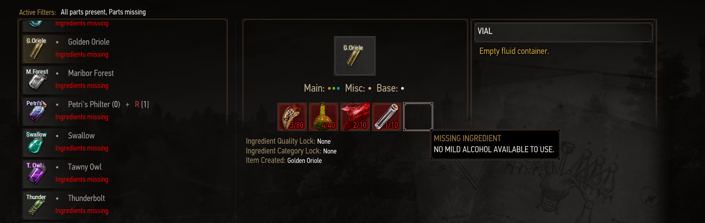

Infinite consumables

# Features
Makes all potions and oils infinite to use but at a greater crafting cost. Also
add a direct crown cost while using consumables.

If you like mods like `Primer` or `Preparations` but don't like spending minutes in the alchemy minute between every fight, then this mod is for you. It makes all potions infinite to use again but keeps the modified recipes. However it drastically increases the initial brewing cost to compensate and also adds a crown cost every time you use one of the consumables.

# Mod menu
The mod menu offers two sliders:
 - Requirement multiplier, it multiplies all brewing requirements by the set value
 - Consuming Crown cost, every time you use an oil or a potion the set amount of crowns is removed from your inventory. If you do not have the crowns in your inventory, the consumption is cancelled.

# Installing
 - download the latest version of this mod
 - confirm you now have a zip archive with two folders named `mod` and `bin` in it
 - drop the folders in your game root directory
 - confirm you now have a `modInfiniteConsumables` folder in your mods folder
 - open the script merger of your choice and start merging.
 - load a save, open the mod menu and apply the default preset, open the alchemy panel and confirm any potion recipe requires 15x more ingredients to brew.